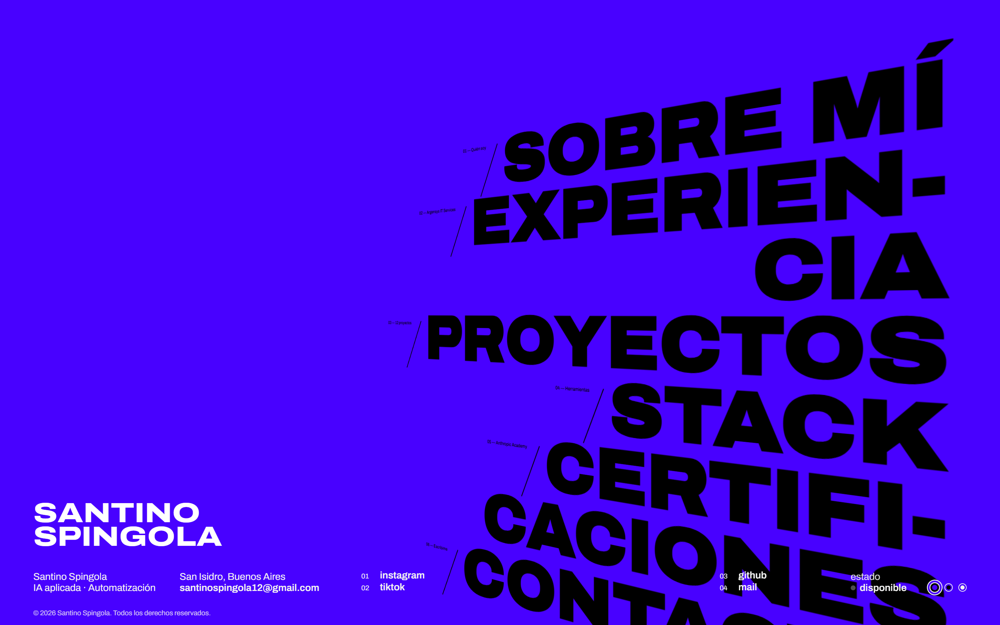

# Portfolio — Santino Spingola

Sitio personal: quién soy, experiencia, proyectos, stack, certificaciones y contacto.

**▶ [portfolio.spingola.com.ar](https://portfolio.spingola.com.ar)** · [CV](https://portfolio.spingola.com.ar/cv/)



## Cómo está hecho

- **HTML, CSS y JavaScript sin framework ni build.** Carga instantánea y cero dependencias que
  mantener.
- Navegación tipográfica a pantalla completa con paneles por sección y
  respeto por `prefers-reduced-motion`.
- CV imprimible en [`cv/`](cv/), servido como página propia.
- Desplegado en **Vercel** con dominio propio.

## Estructura

```
index.html      la página
styles/main.css estilos y tokens
js/main.js      navegación, paneles y datos de certificaciones
cv/             CV en HTML
```

## Correrlo

Abrir `index.html` en el navegador. No hace falta servidor ni instalación.

---

Proyectos destacados: [orbita-crm](https://github.com/SantinoSpingola/orbita-crm) ·
[aula-plataforma-cursos](https://github.com/SantinoSpingola/aula-plataforma-cursos) ·
[n8n-automatizaciones](https://github.com/SantinoSpingola/n8n-automatizaciones)
